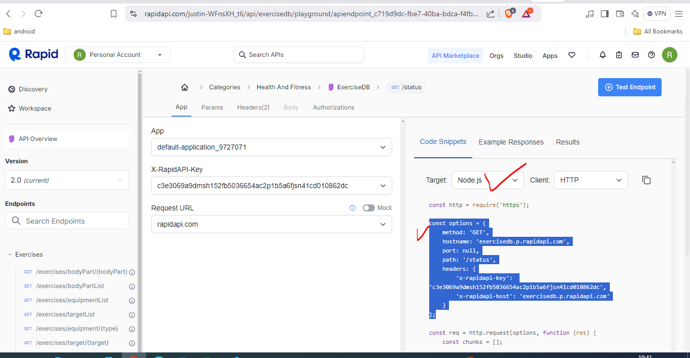

## we are going to use the two apis ------------------------------------
    1) Rapid api
    2) youtube search & download api
    3) image is 
    4)
## ------------------------------------------------------------
2) download the dependency
3)  "@emotion/react": "^11.9.0",
    "@emotion/styled": "^11.8.1",
    "@mui/icons-material": "^5.6.1",
    "@mui/material": "^5.6.1",
    "react": "^18.0.0",
    "react-dom": "^18.0.0",
    "react-horizontal-scrolling-menu": "^2.7.1",
    "react-loader-spinner": "^6.0.0-0",
    "react-router-dom": "^6.3.0",
    "react-scripts": "5.0.1"
4) first copy this all and paste to .json folder and open the terminal and write the command as => npm install --legacy-peer-deps

5) ## -------- Stack ----------------------------------------------
ans --
    1) Stack is a container component for arranging elements vertically or horizontally.

    2) Introduction
        a) The Stack component manages the layout of its immediate children along the vertical or horizontal axis, with optional spacing and dividers between each child.
        b) import Stack from '@mui/material/Stack';
        c) link--> https://mui.com/material-ui/react-stack/

6) output is 
7) 
8) 
9) still this are the static content we don't appy any dynamc content and functinalty.

## --------------- now are going to make the fetch feature ----------------------------
10) ## ---- Utility foler why required in react-js ----------------------------
ans - > 

In React applications, a `utility` folder is often created to organize and store helper functions, constants, and other reusable logic that doesn't fit neatly into specific components or pages. Here’s why it’s beneficial:

1. **Code Reusability**: Commonly used functions (like data formatting, calculations, API calls, etc.) are often placed in a `utility` folder. This helps avoid repetitive code across components by centralizing shared logic, making your codebase DRY (Don’t Repeat Yourself).

2. **Separation of Concerns**: By isolating utilities from components, each part of your app is more focused on a single responsibility. Components handle UI and presentation, while the `utility` folder contains logic, utilities, and constants. This keeps your components cleaner and easier to understand.

3. **Maintainability**: Utilities are more easily maintained when separated. If a utility function needs to be updated, it’s simpler to find and modify it in the `utility` folder without tracking down every instance across your components.

4. **Improved Testing**: When functions are separated into utilities, they’re easier to test independently. Testing utility functions in isolation means they can be fully verified before being integrated into components, making unit tests more manageable.

5. **Consistent Data Transformation**: If multiple components need to transform data in the same way, storing the transformation logic in a utility function keeps data handling consistent across the app.

Typical contents of a `utility` folder in a React app might include:
   - **Helper functions** (e.g., `formatDate`, `capitalize`, `calculateTax`).
   - **Constants** (e.g., predefined arrays or objects, like country lists or status codes).
   - **APIs** (abstracted fetch functions for REST or GraphQL).
   - **Custom Hooks** (e.g., `useFetch`, `useDebounce` for custom reusable logic).

This organization supports clean, modular code, especially for larger or scalable projects.

11) creating a utiltiy folder to define the fetchData() which will fetch the data from given url and option.
12) here the fetchData() function is a user defeine function which is define in utility folder beause to fetch the data 
    from a resource we required the same syntax to make the resuable we are creating in in utility foler.
13) to fetch the data from the rapid api we need to do subnscript with 0 and then test endpoint then you will get the output
14) 
15) 
16) 
17) to getting the all the item type 
18) 
19) 
20) 
21) displaying the data based on search 
22) 

